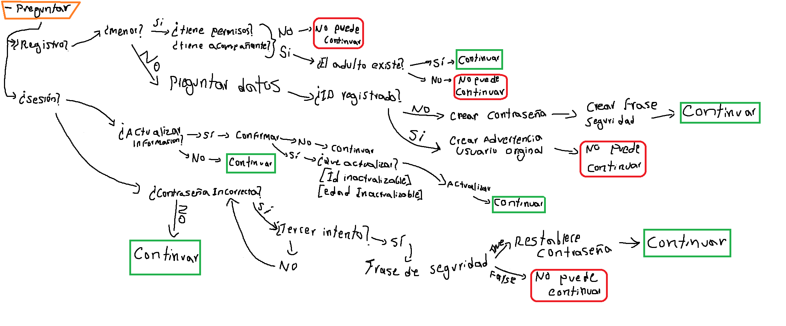
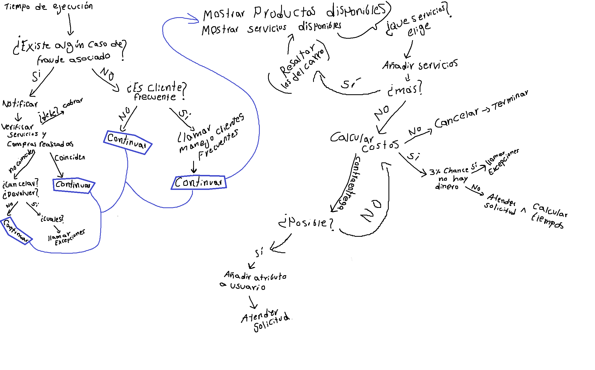

# POO-2024-Proyecto-equipo-3-grupo-2
# Proyecto grupal - Empresa de envíos
## Tabla de contenidos
- [Idea del proyecto](#idea-del-proyecto)
    - [Problema](#problema)
    - [Solución](#solucion)
- [Funcionalidades](#funcionalidades)
    - [Función Recibir solicitudes](#funcion-recibir-solicitudes)
    - [Función Manejar excepciones](#funcion-manejar-excepciones)
    - [Función Atender la solicitud](#funcion-atender-la-solicitud)
    - [Función calcular costos y tiempos](#funcion-calcular-costos-y-envios)
    - [Función Manejo clientes frecuentes](#funcion-manejo-clientes-frecuentes)
- [Impacto clases y objetos](#impacto-clases-y-objetos)
- [Diagrama de interacción](#diagrama-de-interaccion)
- [Diagrama de clase UML](#diagrama-de-clase-uml)

## Idea del proyecto
El proyecto es una simulación de un programa para la compra de servicios y productos por un usuario. El Usuario debe realizar su ingreso dando su nombre, identificación y edad, luego debe elegir entre las opciones para comprar un producto o un servicio. El programa calcula los costos, los tiempos de servicio y retira el dinero. Así mismo se encarga automáticamente de la recolección de devoluciones y cancelaciones de servicios.

### Problema
Problema de entrega y calculo de costos de productos y servicios. ¿Cuánto cuestan los serivicos para una determinada persona?, ¿Puede la persona acceder a los servicios?, ¿Cómo se maneja la devolución de un producto?, ¿Qué hacer en casos de excepciones?, ¿Es el usuario un cliente común? 

### Solución
Se crea un programa para el manejo de todas las veriables y operaciones compuestas por varios factores para determinar los costos y retirar los servicios terminados a su debido momento. El programa funciona automáticamente, procesa las solicitudes de los clientes y ofrece descuentos a clientes frecuentes. El programa se encarga de los procesos complejos de interacciones entre las clases para el procesamiento de las distintas solicitudes y el tipo de cliente: Las opciones varían según la edad del cliente y sus datos personales: El programa recuerda los datos asociados a un cliente. El programa evita el fraude, no pueden existir clientes con la misma ID y diferente nombre.  Los servicios a menores de edad solo pueden ser comprados por un adulto responsable.  Los productos y servicios se acaban, el programa tiene un tiempo de control, retira los servicios culminados o cancelados. El programa puede hacer uso del presupuesto para comprar nuevos productos. El programa actúa cuando un cliente no paga o tiene comportamiento fraudulento. 
## Funcionalidades
Las 5 Funcionalides del programa son:  **1 => Recibir solicitudes** **2 => Manejo de Excepciones** **3=> Atender la solicitud** **4 => Calcular costos y tiempos** **5 => Manejo clientes frecuentes**

### Funcionalidad 1: Recibir Solicitudes
La primera funcionalidad es el núcleo del programa y la única interactuando directamente con el usuario. 
El programa está orientado a recibir un único usuario a la vez, dada su naturaleza multi-usuario, los perfiles y los pedidos son simulados (o realizados) en la inicialización del programa. Durante la ejecución el usuario que ingresa los datos puede ingresar en una de las cuentas ya inicializadas, o crear una nueva.
##### Tres Interacciones =>
###### Ingreso/Registro de Usuario:

**Objetos Involucrados:** Usuario, InterfazConsola, ValidacionDatos, BaseDatosTemporal.
-> Se pregunta al usuario si desea ingresar o iniciar sesión. El objeto InterfazConsola se encarga de imprimir el mensaje y capturar la respuesta, Usuario almacena la información ingresada y ValidacionDatos verifica la validez de los datos.
-> Si el usuario decide registrarse, InterfazConsola solicita datos personales (nombre, identificación, edad, genero, etc), Usuario almacena estos datos y BaseDatosTemporal guarda esta información temporalmente (En la memoria RAM, los datos se borran al cerrarse el programa).

###### Cerrar Sesion/Finalizar programa:
**Objetos Involucrados:** Usuario, InterfazConsola, BaseDatosTemporal, Tiempo.
-> Se pregunta al usario si desea cerrar sesión, el tiempo transcurre aún sin sesión, se imprime en consola las ordenes que hayan llegado y aquellas que han sido confirmadas. 
-> Finalizar el programa.

###### Inicio de Sesión:
**Objetos Involucrados:** Usuario, InterfazConsola, ValidacionDatos.
-> Si el usuario opta por iniciar sesión, InterfazConsola solicita identificación y contraseña, Usuario recupera los datos y ValidacionDatos verifica que coincidan con los registros.

### Funcionalidad 2: Manejo de Excepciones
Esta funcionalididad determina exepciones como aquellas acciones que realiza el usuario que no se encuentran dentro del ciclo normal del programa, cuando existen datos que son determinados no cumplir con los requisitos o cuando se utilzan datos privados de otra cuenta en una nueva.
Tres Interacciones =>
Menores de Edad:
Objetos Involucrados: Usuario, InterfazConsola, ManejoExcepciones.
-> Si la edad del usuario es menor de 18, ManejoExcepciones es llamado para manejar la situación, imprimiendo un mensaje a través de InterfazConsola. Se llaman los métodos correspondientes para menejar la excepción, 

Contraseña Incorrecta:
Objetos Involucrados: Usuario, InterfazConsola, ManejoExcepciones.
Descripción: En caso de que el usuario ingrese una contraseña incorrecta, ManejoExcepciones maneja el error, solicitando una nueva entrada a través de InterfazConsola.

ID Duplicado:
Objetos Involucrados: Usuario, BaseDatosTemporal, ManejoExcepciones.
Descripción: Si se ingresa una identificación que ya existe, ManejoExcepciones alerta al usuario y solicita una nueva entrada, verificando los datos con BaseDatosTemporal.

### Funcionalidad 3: Atender la Solicitud
Actualización de Datos:
Objetos Involucrados: Usuario, InterfazConsola, BaseDatosTemporal.
Descripción: El usuario ingresa un comando para actualizar sus datos. InterfazConsola captura el comando, Usuario actualiza los datos y BaseDatosTemporal guarda los cambios.

Cambio de Contraseña:
Objetos Involucrados: Usuario, InterfazConsola, ValidacionDatos.
Descripción: El usuario ingresa un comando para cambiar su contraseña. InterfazConsola captura el comando, Usuario actualiza la contraseña y ValidacionDatos verifica la seguridad de la nueva contraseña.

Compra de Productos/Servicios:
Objetos Involucrados: Usuario, Inventario, BaseDatosTemporal.
Descripción: El usuario ingresa un comando para comprar productos o servicios. InterfazConsola captura el comando, Inventario verifica la disponibilidad y BaseDatosTemporal procesa la transacción.

### Funcionalidad 4: Calcular Costos y Tiempos
Simulación de Tiempo:
Objetos Involucrados: Tiempo, Servicio, InterfazConsola.
Descripción: La clase Tiempo simula el paso del tiempo, afectando la disponibilidad de servicios. InterfazConsola muestra la actualización del estado de los servicios.

Cálculo de Costos:
Objetos Involucrados: Usuario, Servicio, CalculoCostos.
Descripción: CalculoCostos calcula el costo de los servicios en función del tiempo y el historial del usuario, actualizando los precios en Servicio.

Control de Inventario:
Objetos Involucrados: Inventario, Tiempo, BaseDatosTemporal.
Descripción: Inventario actualiza la disponibilidad de productos y servicios con base en el tiempo simulado, BaseDatosTemporal registra estos cambios.

### Funcionalidad 5: Manejo de Clientes Frecuentes
Identificación de Clientes Frecuentes:
Objetos Involucrados: Usuario, HistorialCompras, InterfazConsola.
Descripción: HistorialCompras identifica a los clientes frecuentes basado en sus compras, Usuario almacena esta información y InterfazConsola muestra notificaciones.

Aplicación de Descuentos:
Objetos Involucrados: Usuario, Descuentos, BaseDatosTemporal.
Descripción: Descuentos calcula y aplica descuentos a clientes frecuentes, BaseDatosTemporal guarda la información actualizada de precios.

Ofertas Especiales:
Objetos Involucrados: Usuario, OfertasEspeciales, InterfazConsola.
Descripción: OfertasEspeciales genera promociones y servicios exclusivos para clientes frecuentes, Usuario recibe estas ofertas y InterfazConsola las comunica.

## Impacto clases y objetos
Las 3 funcionalides interactúan entre sí para los calculos del costo, el tiempo de envío y la llegada de los productos. Las clases Paquete, Bodega, Organizador y Domiciliario tienen estados, que dependen de la clase tiempo y de los límites dados por su capacidad de contención de otros objetos, Las clases Vendedor y Empresa (con sus subclases) interactúan con los objetos de las demás clases y determinan su capacidad de continuar, principalmente dependen de las instancias de Comprador para manetener dinero en sus carteras, el dinero se mueve constantemente y depende del tiempo, cuando no hay dinero los vendedores no pueden satisfacer a los Compradores y las empresas son Destruidas (Caen en bancarrota).  

## Diagrama de interacción
